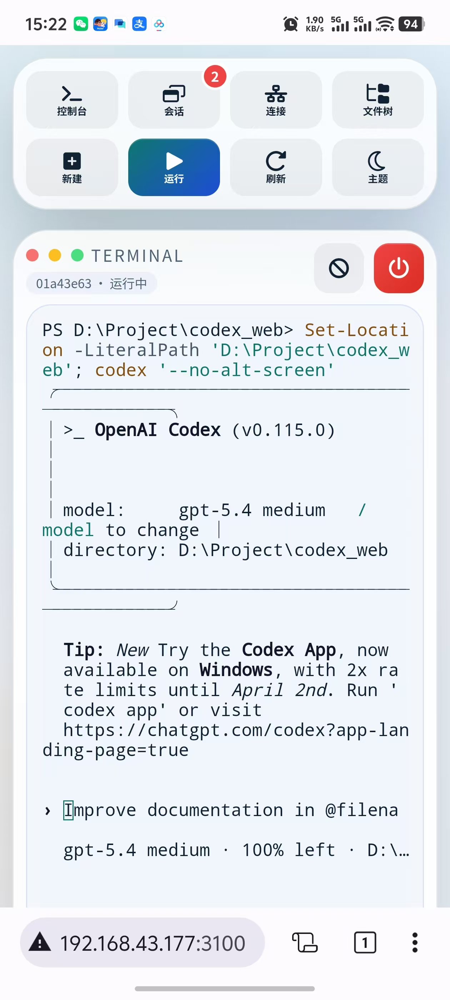
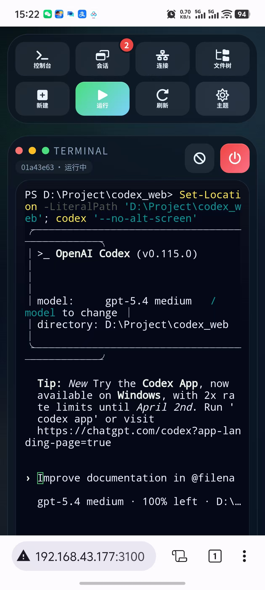

# Codex Web Shell

把本机 `codex` CLI 包成一个可通过浏览器访问的 Web 终端，并允许局域网中的其他设备连接使用。

## 界面预览

<table>
  <tr>
    <td></td>
    <td></td>
  </tr>
</table>

## 功能

- 浏览器中直接运行本机 `codex` CLI
- 通过 WebSocket 转发真实终端交互，支持全屏 TUI
- 会话列表与重连，多个设备可附着到同一个会话
- 可选访问口令
- 仅允许在指定根目录下启动会话，降低误操作风险

## 启动

```powershell
npm install
npm start
```

默认监听：

- 本机: `http://127.0.0.1:3100`
- 局域网: 启动日志会打印形如 `http://192.168.x.x:3100`

## 环境变量

```powershell
$env:HOST="0.0.0.0"
$env:PORT="3100"
$env:CODEX_ALLOWED_ROOT="D:\Project"
$env:CODEX_DEFAULT_CWD="D:\Project\codex_web"
$env:CODEX_DEFAULT_ARGS="--no-alt-screen"
$env:CODEX_WEB_TOKEN="your-secret"
$env:MAX_SESSIONS="8"
npm start
```

说明：

- `CODEX_ALLOWED_ROOT`: Web 端允许创建会话的根目录，所有工作目录必须位于它之下
- `CODEX_DEFAULT_CWD`: 新建会话时默认工作目录
- `CODEX_DEFAULT_ARGS`: 每次启动 `codex` 时自动附加的默认参数
- `CODEX_WEB_TOKEN`: 设置后，前端和 WebSocket 连接都必须带这个口令

## 使用方式

1. 打开浏览器访问服务地址
2. 如配置了口令，先输入口令
3. 设置工作目录和额外参数
4. 点击“启动 Codex”

## 安全建议

- 局域网开放前，强烈建议设置 `CODEX_WEB_TOKEN`
- 如果需要跨网段访问，请再额外配置反向代理和 HTTPS
- 当前版本默认信任登录到网页的使用者，因为其本质是在远程操作服务器上的本地 Codex CLI
